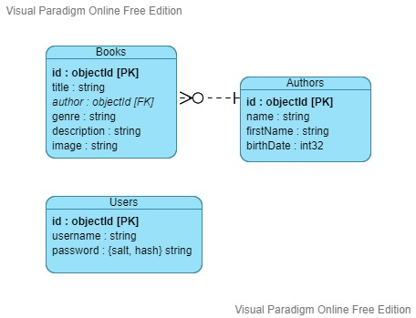

# Final Project 3W Academy - Look 4 Books

## Requirements

### Global

- use at least npm 8.4
- use at least node 16.13
- install mongodb compass

### Software

- clone the repository
- npm init -y
- npm install
- create .env file and fill it with :
  - APP_LOCALHOST = localhost
  - APP_PORT = 3000
  - SECRET_APP = <i>your password</i>
  - DB_CREDENTIALS = mongodb://localhost/look4books

## How to use

- first, sign up, you'll be automatically logged in
- add new author
- add new book attached to one of the author you just created
- you can create, update and delete books and authors

## Entity relationship diagram

